# Matekassen-Assets

Dies ist eine Sammlung von Produktbildern für Getränkekassen in Hackspaces.

- 640x640px
- 40px Safe Zone
- 8-bit PNG in sRGB

## 1337mate

### 330ml
&nbsp;

## Afri Cola

### 200ml
&nbsp;
&nbsp;
&nbsp;
&nbsp;

### 330ml
&nbsp;
&nbsp;
&nbsp;
&nbsp;

### 500ml
&nbsp;
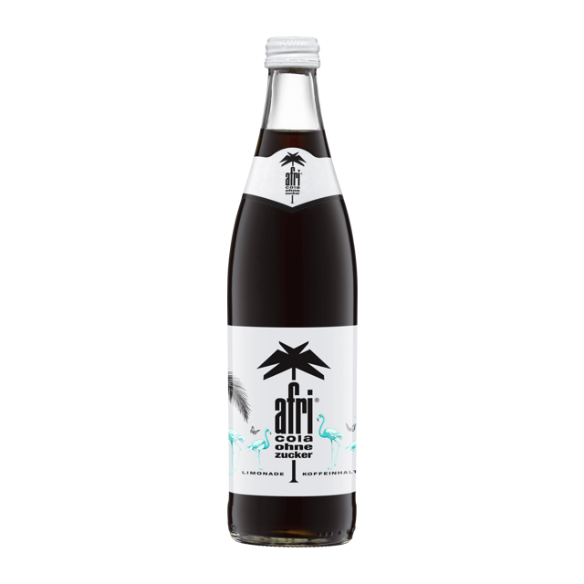&nbsp;

### 1l
&nbsp;
&nbsp;
&nbsp;

## Club Mate

### 330ml
&nbsp;
&nbsp;

### 500ml
&nbsp;
&nbsp;
&nbsp;
&nbsp;
&nbsp;
&nbsp;

## Flora
&nbsp;
&nbsp;

## Fritz

### 200ml
&nbsp;
&nbsp;
&nbsp;
&nbsp;
&nbsp;
&nbsp;
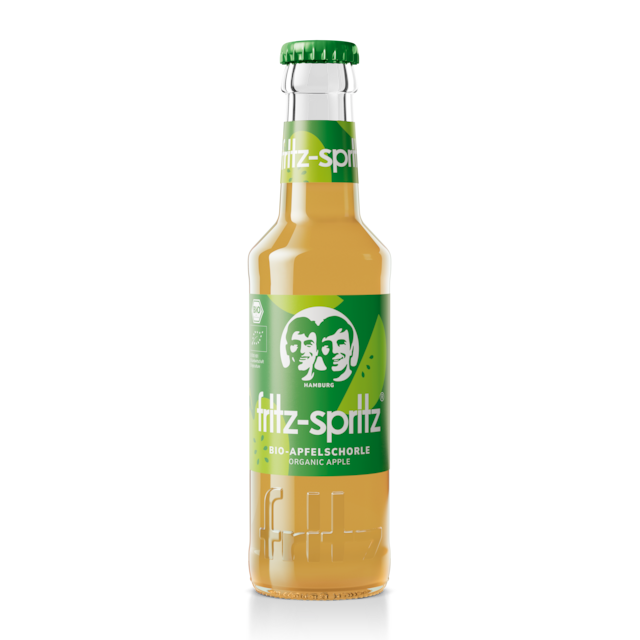&nbsp;
&nbsp;
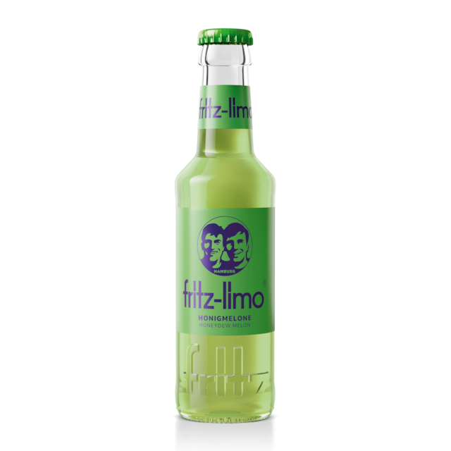&nbsp;
&nbsp;
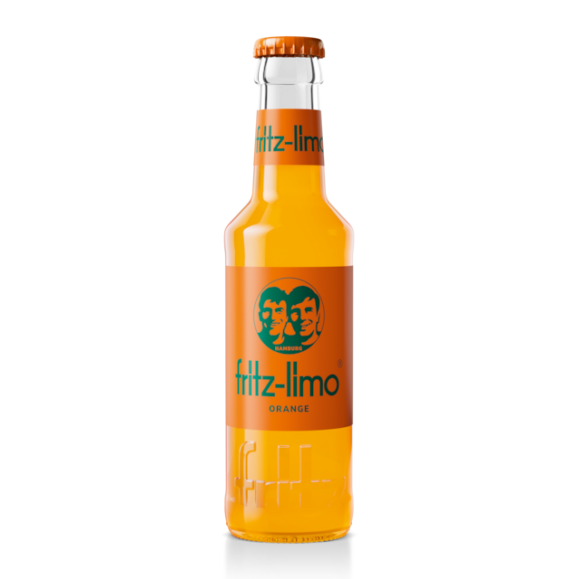&nbsp;
&nbsp;
&nbsp;

### 330ml
&nbsp;
&nbsp;
&nbsp;
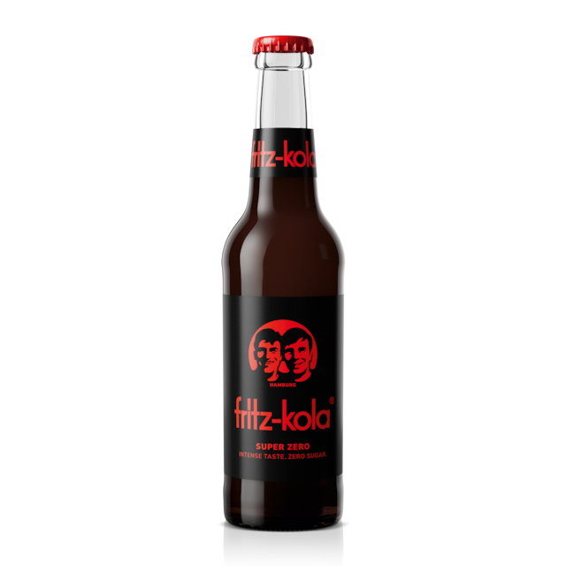&nbsp;
&nbsp;
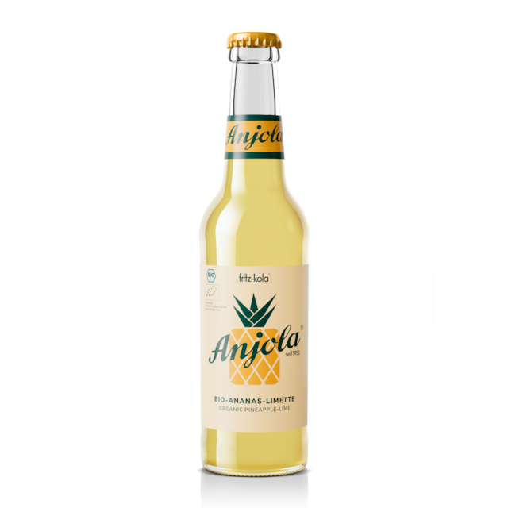&nbsp;
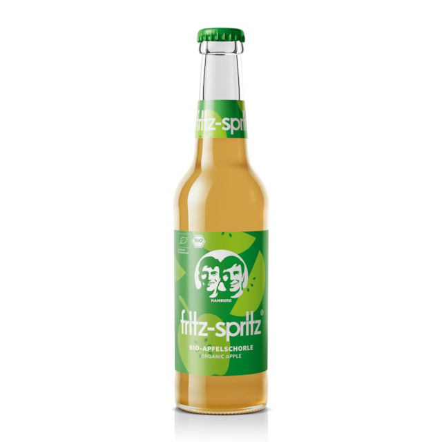&nbsp;
&nbsp;
&nbsp;
&nbsp;
&nbsp;
&nbsp;
&nbsp;
&nbsp;

### 500ml
&nbsp;
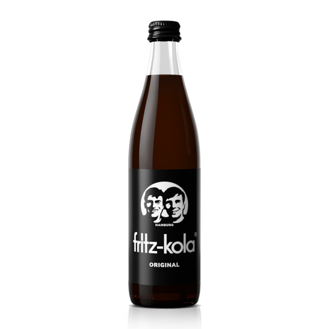&nbsp;
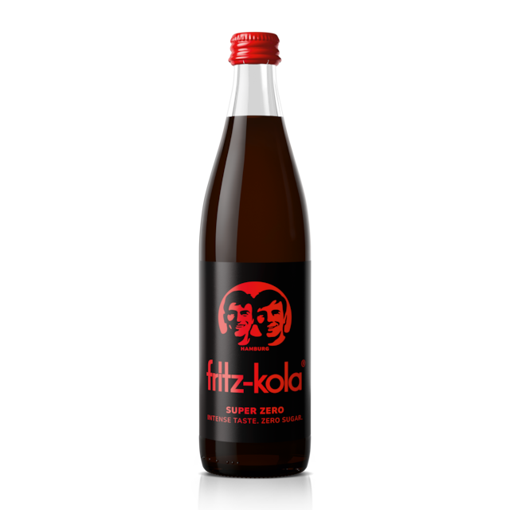&nbsp;
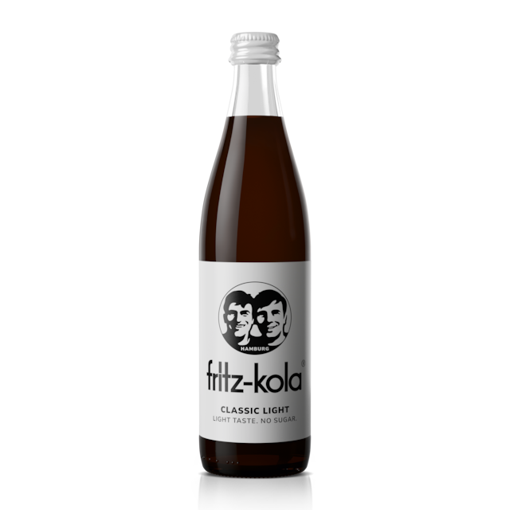&nbsp;
&nbsp;
&nbsp;
&nbsp;
&nbsp;
&nbsp;

## Hermann
&nbsp;
&nbsp;
&nbsp;
&nbsp;
&nbsp;
&nbsp;
&nbsp;
&nbsp;
&nbsp;
&nbsp;

## Lapacho
&nbsp;

## Lemonaid
&nbsp;
&nbsp;
&nbsp;
&nbsp;
&nbsp;
&nbsp;
&nbsp;
&nbsp;
&nbsp;
&nbsp;
&nbsp;

## MioMio

### 330ml
&nbsp;
&nbsp;
&nbsp;
&nbsp;
&nbsp;
&nbsp;
&nbsp;
&nbsp;
&nbsp;

### 500ml
&nbsp;
&nbsp;
&nbsp;
&nbsp;
&nbsp;
&nbsp;
&nbsp;
&nbsp;
&nbsp;
&nbsp;
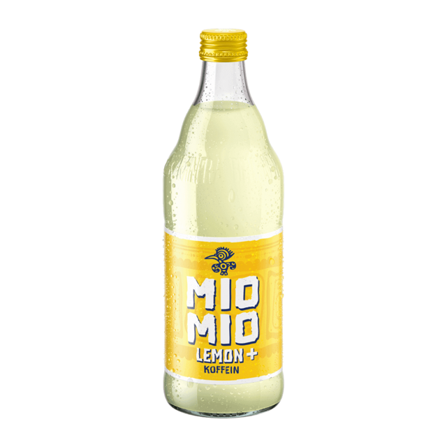&nbsp;
&nbsp;
&nbsp;

## Orangina
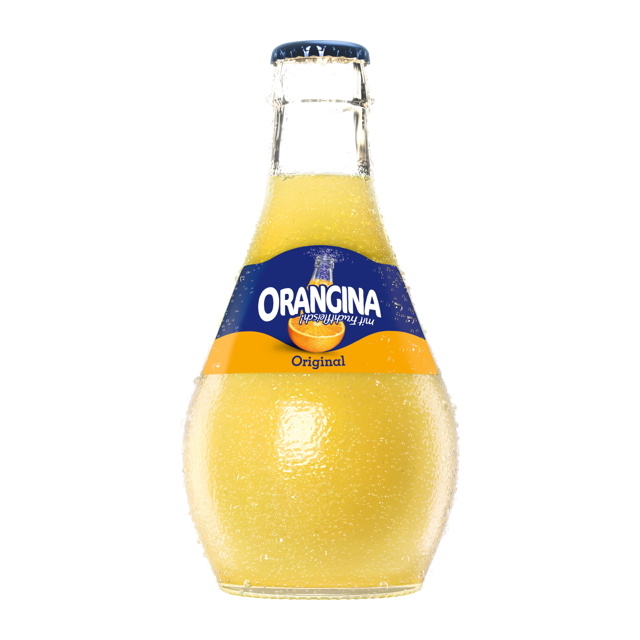&nbsp;
&nbsp;

## Premium
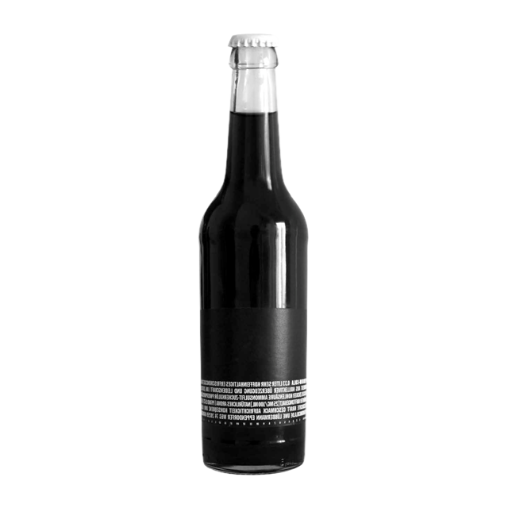&nbsp;
&nbsp;

## Proviant
&nbsp;
&nbsp;
&nbsp;
&nbsp;
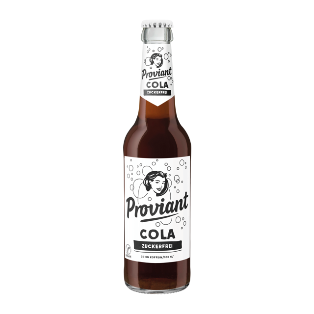&nbsp;
&nbsp;
&nbsp;
&nbsp;
&nbsp;
&nbsp;
&nbsp;

## Sinalco

### 200ml
&nbsp;
&nbsp;
&nbsp;
&nbsp;

### 330ml
&nbsp;
&nbsp;
&nbsp;
&nbsp;
&nbsp;

### 500ml
&nbsp;
&nbsp;
&nbsp;
&nbsp;

## Spezi

### 330ml
&nbsp;
&nbsp;
&nbsp;
&nbsp;

### 500ml
&nbsp;
&nbsp;
&nbsp;
&nbsp;

## Vitamalz
&nbsp;
&nbsp;
&nbsp;

## Viva Con Agua
&nbsp;
&nbsp;

## Volt
&nbsp;
&nbsp;

## Wostok
&nbsp;
&nbsp;

## Currencies

### Euro
&nbsp;
&nbsp;
&nbsp;
&nbsp;
&nbsp;
&nbsp;
&nbsp;
