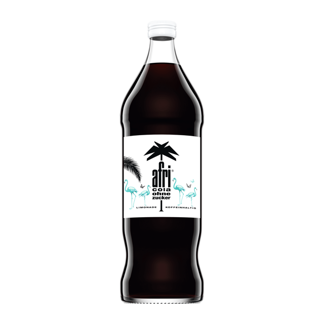
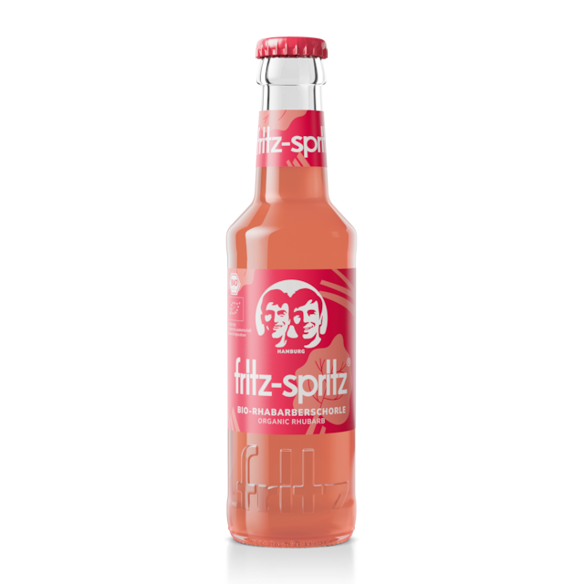
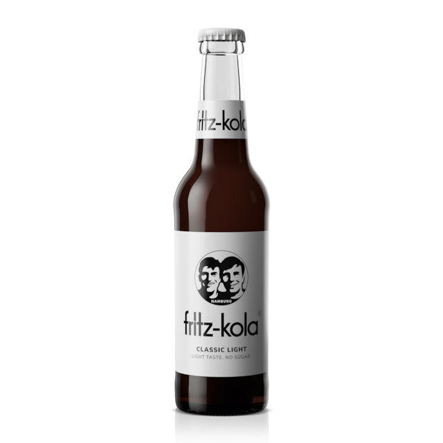
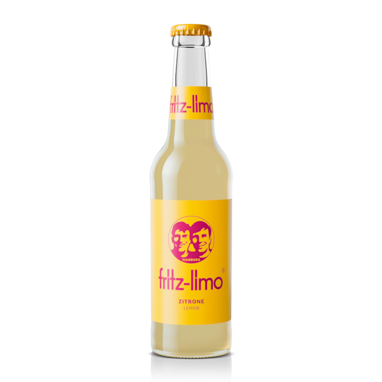
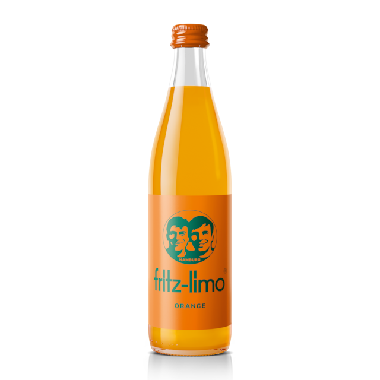
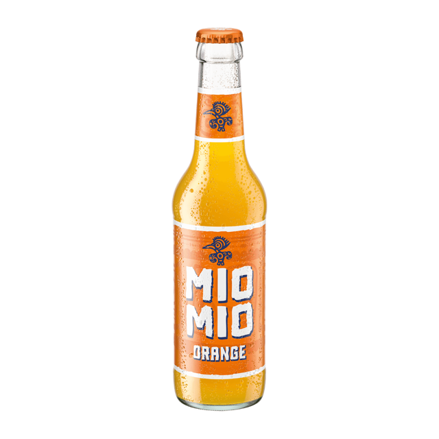
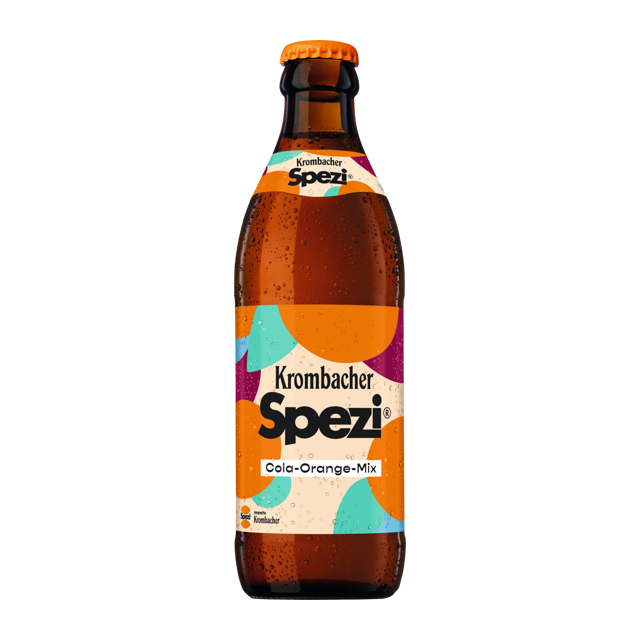
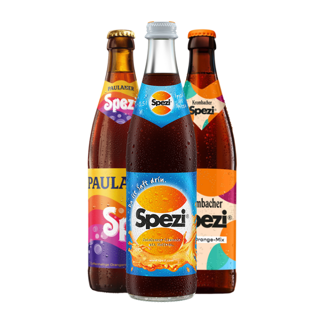

# Matekassen-Assets

Dies ist eine Sammlung von Produktbildern für Getränkekassen in Hackspaces.

- 640x640px
- 40px Safe Zone
- 8-bit PNG in sRGB

## 1337mate

### 330ml
&nbsp;

## Afri-Cola

### 200ml
&nbsp;
&nbsp;
&nbsp;
&nbsp;

### 330ml
&nbsp;
&nbsp;
&nbsp;
&nbsp;

### 500ml
&nbsp;
&nbsp;

### 1000ml
&nbsp;
&nbsp;
&nbsp;

## Beckersbester

### 330ml
&nbsp;
&nbsp;
&nbsp;
&nbsp;
&nbsp;

## Club Mate

### 330ml
&nbsp;
&nbsp;

### 500ml
&nbsp;
&nbsp;
&nbsp;
&nbsp;
&nbsp;
&nbsp;

## Flora

### 330ml
&nbsp;

### 500ml
&nbsp;

## Fritz

### 200ml
&nbsp;
&nbsp;
&nbsp;
&nbsp;
&nbsp;
&nbsp;
&nbsp;
&nbsp;
&nbsp;
&nbsp;
&nbsp;
&nbsp;

### 330ml
&nbsp;
&nbsp;
&nbsp;
&nbsp;
&nbsp;
&nbsp;
&nbsp;
&nbsp;
&nbsp;
&nbsp;
&nbsp;
&nbsp;
&nbsp;
&nbsp;
&nbsp;
&nbsp;

### 500ml
&nbsp;
&nbsp;
&nbsp;
&nbsp;
&nbsp;
&nbsp;
&nbsp;
&nbsp;
&nbsp;

## Gesaris

### 330ml
&nbsp;

## Hermann

### 330ml
&nbsp;
&nbsp;
&nbsp;
&nbsp;
&nbsp;
&nbsp;
&nbsp;
&nbsp;
&nbsp;
&nbsp;
&nbsp;

## Klar

### 700ml
&nbsp;
&nbsp;
&nbsp;
&nbsp;

## Kräuterbraut

### 330ml
&nbsp;
&nbsp;
&nbsp;
&nbsp;

## Lapacho

### 500ml
&nbsp;

## Lemonaid

### 330ml
&nbsp;
&nbsp;
&nbsp;
&nbsp;
&nbsp;
&nbsp;
&nbsp;
&nbsp;
&nbsp;
&nbsp;
&nbsp;

## Lütts Landlust

### 330ml
&nbsp;
&nbsp;
&nbsp;
&nbsp;
&nbsp;
&nbsp;
&nbsp;
&nbsp;
&nbsp;

## Mio Mio

### 330ml
&nbsp;
&nbsp;
&nbsp;
&nbsp;
&nbsp;
&nbsp;
&nbsp;
&nbsp;
&nbsp;

### 500ml
&nbsp;
&nbsp;
&nbsp;
&nbsp;
&nbsp;
&nbsp;
&nbsp;
&nbsp;
&nbsp;
&nbsp;
&nbsp;
&nbsp;
&nbsp;

## Orangina

### 250ml
&nbsp;
&nbsp;

## Paulaner

### 330ml
&nbsp;
&nbsp;
&nbsp;
&nbsp;

### 500ml
&nbsp;
&nbsp;
&nbsp;
&nbsp;

## Premium

### 330ml
&nbsp;

### 500ml
&nbsp;

## Proviant

### 330ml
&nbsp;
&nbsp;
&nbsp;
&nbsp;
&nbsp;
&nbsp;
&nbsp;
&nbsp;
&nbsp;
&nbsp;
&nbsp;

## Sinalco

### 200ml
&nbsp;
&nbsp;
&nbsp;
&nbsp;

### 330ml
&nbsp;
&nbsp;
&nbsp;
&nbsp;
&nbsp;

### 500ml
&nbsp;
&nbsp;
&nbsp;
&nbsp;

## Spezi

### 330ml
&nbsp;
&nbsp;
&nbsp;

### 500ml
&nbsp;
&nbsp;
&nbsp;
&nbsp;
&nbsp;
&nbsp;
&nbsp;
&nbsp;

## Vitamalz

### 330ml
&nbsp;
&nbsp;

### 500ml
&nbsp;

## Viva con Agua

### 330ml
&nbsp;
&nbsp;

## Volt

### 500ml
&nbsp;
&nbsp;

## Wostok

### 330ml
&nbsp;
&nbsp;

## Currencies

### Euro
&nbsp;
&nbsp;
&nbsp;
&nbsp;
&nbsp;
&nbsp;
&nbsp;
